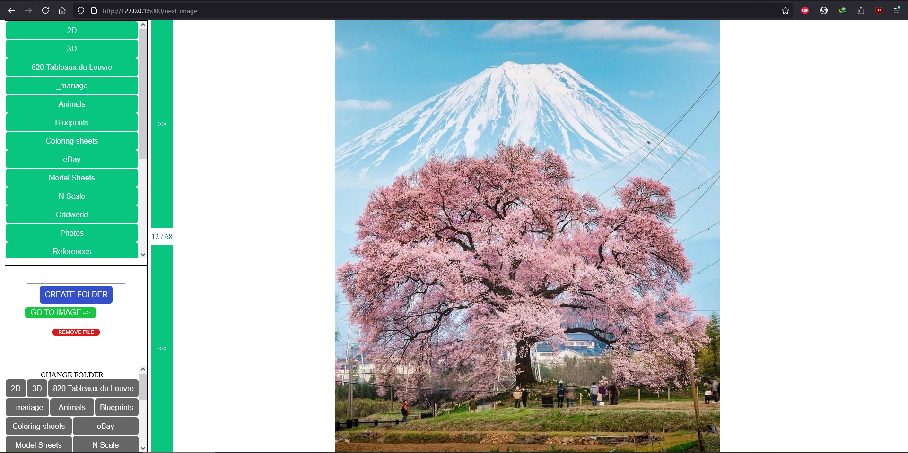

*last updated on October 15, 2025 - Python 3.10.9*

# ZUPAPictures Sorter - Because I was fed up selecting and moving files to their target folder
A small Flask app that allows one to sort (move or remove) pictures to sub-folders in one click.

What you can do:
- Move a picture to a target folder by simply clicking on the filder you want it to move to
- Cancel the last move
- Remove a picture
- Create a folder inside the folder you are currently browsing
- Go to another subfolder (and do the same stuff as above - yea I know, it kicks ass)
- Go back to the parent folder
- Jump to an image by entering its corresponding number (nothing will happen if the number is beyond what's available)

What you cannot do:
- summon a hot Elf
- get free coffee
- sort files other than PNG / JPG / JPEG (not that others formats wouldn't work, I only implemented what I needed)

# Preview (October 15, 2025)

# Pre-requisites
- Python 3.10.9+
- Flask 3.1.1+
- The *.bat file is to quickly launch the script on Windows.
- 
I don't want to hear any complaints about the "DRY" law.
I made most of that app in an evening, I have little knowledge in Flask (I focused on Django), I only wanted something that does the job. So the code is extremely redundant. I tried a few things that didn't work, so I came up with global variables as they are shared through different URLs and must be updated through most actions.
